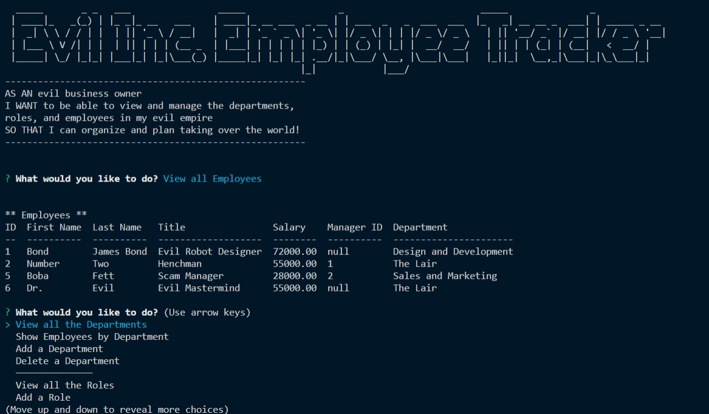

# employee-tracker

   

  ## Table of Contents
  1. [Description](#description)
  2. [Installation Instructions](#installation-instructions)
  3. [Usage Information](#usage-information)
  4. [Questions](#questions)
 
  
  ## Description
  View and manage departments, roles and employees in your organization with this Node.js app.

  This application is created in Node.js with MySql2 npm package which connects to user's MySql database.

  Inquirer prompts guide the user through a series of database views and opportunities to edit employees, roles and departments in a variety of ways.

  

  [Github Pages](https://github.com/webprinc3ss/employee-tracker)

  [Link to Demo](https://drive.google.com/file/d/1GrXpWn0IqJ5DotfnKPZIRmcRWp6FbmZb/view)

  ## Installation Instructions
    1. [Clone the repo](https://github.com/webprinc3ss/readme-generator.git)

    2. [Install node.js](https://nodejs.org/en/)

    3. [Install npm](https://www.npmjs.com/package/inquirer)

    4. [Install sql2](https://www.npmjs.com/package/mysql2)

    5. Add your sql password to the following function:

        const connection = mysql.createConnection({
            ...
            password: "password_here",
            ...
        });

    6. [Install console.table](https://www.npmjs.com/package/console.table)

    7. [Install figlet](https://www.npmjs.com/package/figlet)

    8. Initiate the database (in Bash): 
        
        npm run db:init (If you use my package.json script.)
        npm run db:seed 

        Otherwise run

        mysql -u root -p < db/schema.sql
        mysql -u root -p < db/seeds.sql
   
  ## Usage Information
  After you have installed the above, open your terminal and enter, "node index" to start the app.

  ## Questions
  Please feel free to contact me, webprinc3ss at Github: https://github.com/webprinc3ss 

  or

  djabranton@gmail.com. 
      